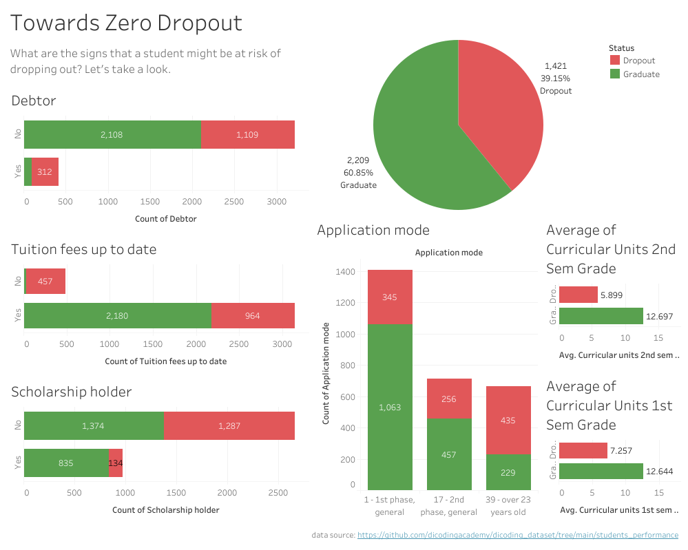

# zero-dropout

link akses streamlit: <br>
https://towards-zero-dropout.streamlit.app/


bisa diuji coba dengan menggunakan file csv berikut (ada di repo yang sama): <br>
df_status_enrolled.csv


## Business Understanding

Sejak didirikan pada tahun 2000, Jaya Jaya Institut telah dikenal sebagai institusi pendidikan tinggi yang menghasilkan lulusan-lulusan berkualitas dan berdaya saing tinggi. Meskipun demikian, dalam perjalanannya, institusi ini menghadapi permasalahan serius terkait tingginya jumlah mahasiswa yang mengalami dropout atau tidak menyelesaikan studi mereka.

Fenomena dropout ini dipandang sebagai isu penting yang dapat berdampak langsung pada reputasi institusi serta efektivitas proses pendidikan yang diselenggarakan. Oleh karena itu, diperlukan upaya sistematis untuk mendeteksi potensi dropout secara dini agar intervensi yang tepat dapat diberikan sebelum mahasiswa benar-benar dropout.

Dalam rangka mendukung upaya tersebut, dilakukan proyek analisis data yang bertujuan untuk mengidentifikasi faktor-faktor utama yang berkontribusi terhadap risiko dropout. Analisis ini dilakukan dengan menggunakan data performa mahasiswa yang mencakup berbagai aspek, seperti status pembayaran biaya kuliah, kepemilikan beasiswa, status utang, mode pendaftaran, serta jumlah SKS yang diambil pada semester awal.

Sebagai bagian dari proyek ini, sebuah dashboard interaktif juga dikembangkan untuk mempermudah pemantauan data mahasiswa oleh pihak manajemen dan akademik. Dashboard ini diharapkan dapat membantu dalam mengidentifikasi pola-pola tertentu yang berkaitan dengan risiko dropout, sehingga proses pengambilan keputusan dan pemberian intervensi dapat dilakukan secara lebih cepat dan tepat sasaran.

Selain dashboard, pada proyek ini dibangun sebuah aplikasi web berbasis machine learning yang dapat digunakan untuk memprediksi status mahasiswa, apakah berpotensi dropout, atau menyelesaikan studinya. Aplikasi ini memungkinkan pengguna untuk memasukkan data mahasiswa dan memperoleh prediksi secara instan, sehingga proses identifikasi risiko dapat dilakukan secara lebih efisien dan terukur.


### Permasalahan Bisnis

Untuk membantu institut dalam menangani tingginya angka dropout, pada proyek ini kita akan menggunakan data untuk menjawab pertanyaan bisnis: 

>Bagaimana cara mengetahui pola perbedaan antara mahasiswa yang dropout dengan yang lulus?

### Cakupan Proyek

- Membangun dashboard untuk memberikan gambaran perbedaan antara karyawan yang mengundurkan diri dengan yang tidak. 
- Membangun web app dengan streamlit agar model machine learning prediksi status dropout/lulus teraplikasikan. 

### Persiapan

Sumber data: https://github.com/dicodingacademy/dicoding_dataset/tree/main/students_performance


Setup environment - Shell/Terminal:

```
mkdir proyek_dropout_problem
cd proyek_dropout_problem
pipenv install
pipenv shell
pip install -r requirements.txt
```

## Business Dashboard

Link dashboard (Tableau Public): https://public.tableau.com/views/DropoutPreventionDashboard/Dashboard?:language=en-US&:sid=&:redirect=auth&:display_count=n&:origin=viz_share_link

Link video penjelasan dashboard dan web app: https://drive.google.com/file/d/1XIuq9FSFegshALoyAui-UOsvUevXGi-A/view?usp=drive_link



Dashboard ini menampilkan jumlah mahasiswa yang lulus dan yang dropout, serta pola-pola yang menonjol berdasarkan status utang, pembayaran uang kuliah, kepemilikan beasiswa, mode pendaftaran, hingga rata-rata jumlah SKS yang diambil pada semester 1 dan semester 2.

Berdasarkan chart pada dashboard, dapat dilihat bahwa:
- Mahasiswa yang **memiliki utang (debt)** cenderung lebih banyak yang **dropout** dibandingkan yang lulus.
- Mahasiswa yang **tidak membayar uang kuliah tepat waktu** juga memiliki kemungkinan lebih besar untuk dropout.
- Kepemilikan **beasiswa (scholarship)** menjadi indikator positif: proporsi mahasiswa **pemegang beasiswa yang lulus** jauh lebih tinggi dibandingkan yang dropout.
- Mode pendaftaran juga berpengaruh: mahasiswa yang mendaftar lewat **fase pertama (umum)** lebih banyak yang lulus, sedangkan mereka yang mendaftar di **fase kedua** atau **berusia di atas 23 tahun** cenderung lebih banyak yang dropout.
- Rata-rata jumlah **SKS yang diambil** di semester 1 dan 2 juga menunjukkan perbedaan mencolok: mahasiswa yang lulus mengambil SKS jauh lebih banyak dibandingkan mahasiswa yang dropout.

Dari temuan ini, dapat disimpulkan bahwa masalah finansial (utang dan keterlambatan pembayaran), latar belakang pendaftaran, dan keterlibatan akademik (jumlah SKS yang diambil) menjadi indikator utama risiko mahasiswa untuk mengalami dropout.

## Menjalankan Sistem Machine Learning

Run Streamlit app.py:
```
streamlit run app.py
```

atau bisa diakses langsung dengan menggunakan link Streamlit Cloud berikut:
https://towards-zero-dropout.streamlit.app/

Untuk uji coba prediksi bisa dilakukan dengan meng-upload file df_status_enrolled.csv pada bagian yang diminta di web app streamlit (file tersedia pada direktori yang sama dengan README.me ini).

## Conclusion

Berdasarkan analisis data dan visualisasi interaktif melalui dashboard, proyek ini berhasil mengidentifikasi sejumlah pola signifikan yang membedakan mahasiswa yang dropout dengan yang lulus. Pola-pola ini menunjukkan bahwa penyebab mahasiswa dropout tidak bersifat acak, melainkan dipengaruhi oleh faktor-faktor tertentu yang dapat diukur dan dimonitor, seperti usia, serta status akademik dan keuangan.

### Rekomendasi Action Items

Berikut beberapa rekomendasi action items yang harus dilakukan institut guna menyelesaikan permasalahan dropout yang tinggi. 


Berikut langkah-langkah konkrit yang dapat dilakukan untuk mencegah dropout berdasarkan masing-masing faktor risiko:

1. **Perkuat Dukungan Akademik untuk Mahasiswa dengan Nilai Rendah**
   - Lakukan mentoring atau pendampingan akademik.
   - Sediakan program remedial, kelas tambahan, atau tutor sebaya.
   - Evaluasi metode belajar dan kesesuaian kurikulum.

2. **Tindak Lanjut untuk Mahasiswa dengan Performa Akademik yang Tidak Meningkat**
   - Tindak lanjut akademik lanjutan untuk mahasiswa yang tidak menunjukkan perbaikan dari semester sebelumnya.
   - Konseling akademik dan psikologis untuk memetakan hambatan belajar.

3. **Permudah Akses Pembayaran Biaya Kuliah**
   - Tawarkan skema cicilan atau keringanan pembayaran.
   - Identifikasi alasan keterlambatan (masalah ekonomi, administratif, dsb.).
   - Koordinasi dengan bagian keuangan atau yayasan untuk opsi bantuan.

4. **Atasi Masalah Mahasiswa Berstatus Debtor**
   - Fokus pada pelunasan tunggakan: tawarkan mekanisme penjadwalan ulang pembayaran.
   - Hubungi mahasiswa secara langsung untuk klarifikasi dan bantuan.

5. **Perluas Akses terhadap Program Beasiswa**
   - Evaluasi kelayakan mahasiswa untuk mendapatkan beasiswa internal/eksternal.
   - Sosialisasikan program beasiswa dan prosedurnya secara lebih luas dan jelas.

6. **Fasilitasi Adaptasi Mahasiswa Kelompok Usia > 23 Tahun**
   - Adakan orientasi khusus untuk mahasiswa non-tradisional atau jalur tahap 2.
   - Fleksibilitas waktu kuliah untuk mahasiswa yang bekerja atau memiliki tanggung jawab lain.
   - Sediakan kelompok pendampingan sebaya atau komunitas sesama mahasiswa kelompok usia di atas 23 tahun.
   - Kurikulum berbasis pengalaman dan kontekstualisasi studi untuk relevansi yang lebih tinggi.
